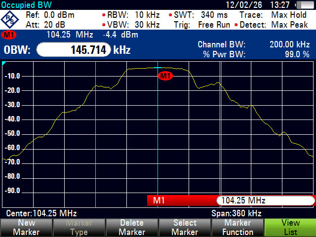
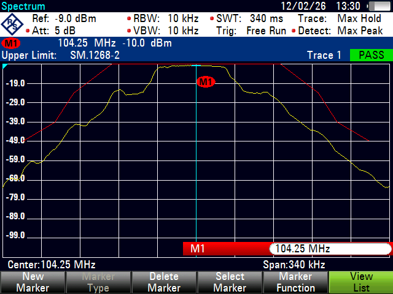
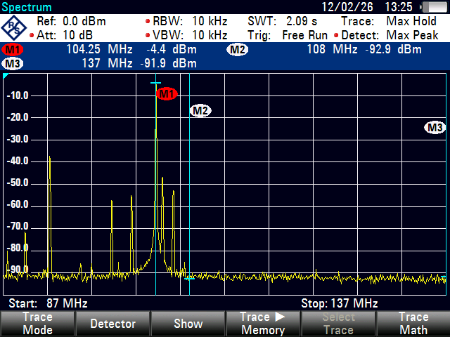

# พารามิเตอร์การตรวจวัดสถานีวิทยุ FM

อธิบายค่าพารามิเตอร์ที่ใช้ในการตรวจสอบมาตรฐานทางเทคนิคของสถานีวิทยุกระจายเสียงระบบ FM ตามมาตรฐาน กสทช. และอ้างอิง ITU-R

---

## 1. Occupied Bandwidth (แบนด์วิดท์ที่ครอบครอง)

**คืออะไร**: ความกว้างของช่องสัญญาณที่สถานีวิทยุ FM ใช้จริงในการแพร่คลื่น วัดจากสเปกตรัมของสัญญาณที่ส่งออกอากาศ

**ทำไมต้องตรวจ**: ถ้าสถานีแพร่คลื่นกว้างเกินกว่าที่ได้รับอนุญาต จะไปรบกวนสถานีข้างเคียงที่อยู่ในความถี่ใกล้กัน

**มาตรฐาน**:

- วิทยุ FM มี Necessary Bandwidth = **180 kHz** (สัญญาณ Stereo + RDS)
- Occupied Bandwidth ต้องไม่เกินค่า Necessary Bandwidth ที่กำหนด

**วิธีวัดตาม ITU-R SM.443** — มี 2 วิธี:

**วิธีที่ 1: 99% Power Bandwidth (วิธีที่ใช้จริงในภาพตัวอย่าง)**

วัดโดยหาช่วงความถี่ที่ **กำลังส่งรวม 99%** ของกำลังทั้งหมดอยู่ภายใน โดยตัดกำลังส่งส่วนที่เหลือ 0.5% ทางซ้ายและ 0.5% ทางขวาออก

```
         ▲ Power
         │
         │    ┌──────────┐
         │   ╱ ██████████ ╲
         │  ╱ ████████████ ╲         ██ = 99% ของกำลังทั้งหมด
         │ ╱ ██████████████ ╲
         │╱ ████████████████ ╲
         └────────────────────────► Frequency
         0.5%◄─ 99% Power ──►0.5%
              ◄─ Occupied BW ──►
```

- เครื่อง Spectrum Analyzer จะรวมกำลังทั้งหมดใน Channel BW แล้วหาจุดที่ตัด 0.5% ทั้งสองฝั่ง
- เหมาะสำหรับสัญญาณ FM เพราะวัดกำลังจริงที่ส่งออกอากาศ

**วิธีที่ 2: x dB Method**

วัดจากจุดสูงสุดของสเปกตรัม แล้วหาจุดที่สัญญาณลดลง x dB ทั้งสองฝั่ง (x = 26 dB สำหรับ FM)

```
         ▲ Power
         │
    0 dB │    ┌──────────┐
         │   ╱            ╲
  -26 dB │──╱──────────────╲──  ← จุดวัด
         │ ╱                ╲
         │╱                  ╲
         └────────────────────────► Frequency
           ◄─ Occupied BW ──►
```

!!! note "ทั้งสองวิธีให้ผลใกล้เคียงกัน"

    ตาม ITU-R SM.443 ค่า x dB ถูกเลือกมาให้ผลลัพธ์เท่ากับ 99% power bandwidth สำหรับแต่ละประเภทการ modulate

**ตัวอย่างจากเครื่องจริง** — วัดสถานี 104.25 MHz ด้วย **วิธี 99% Power** ได้ OBW = 145.714 kHz (ผ่านเกณฑ์ 200 kHz):



จากภาพ: Channel BW = 200 kHz, % Pwr BW = 99.0% → เครื่องคำนวณว่า 99% ของกำลังอยู่ใน **145.714 kHz** ซึ่งน้อยกว่า 180 kHz = **ผ่าน**

!!! tip "ตั้งค่า Spectrum Analyzer"

    | พารามิเตอร์ | ค่าที่แนะนำ | เหตุผล |
    |------------|------------|--------|
    | **Center Freq** | ความถี่กลางของสถานี (เช่น 100.5 MHz) | ตั้งตรงกลางสัญญาณ |
    | **Span** | 360 kHz - 1 MHz | กว้างพอให้เห็นขอบสัญญาณทั้งสองฝั่ง |
    | **RBW** | 10 kHz | ละเอียดพอให้เห็นรูปร่างสเปกตรัม |
    | **VBW** | 1 - 3 เท่า RBW | ลด noise ให้อ่านค่าได้ชัด |
    | **Detector** | Sample หรือ RMS แล้วแต่| สำหรับวัด Occupied BW |
    | **Trace** | Max Hold (3-5 sweeps) | จับค่าสูงสุดให้ครบทุก modulation |

---

## 2. Frequency Deviation (การเบี่ยงเบนความถี่)

**คืออะไร**: ค่าที่ความถี่ของสัญญาณ FM เบี่ยงเบนออกจากความถี่กลาง (carrier) เมื่อมีการ modulate เสียง ยิ่งเสียงดัง ค่า deviation ยิ่งมาก

**ทำไมต้องตรวจ**: ถ้า deviation สูงเกินไป สัญญาณจะกว้างเกินและรบกวนช่องข้างเคียง ถ้าน้อยเกินไป เสียงจะเบาและคุณภาพไม่ดี

**มาตรฐาน**:

- **Maximum Frequency Deviation**: +/- 75 kHz สำหรับ FM Broadcasting
- ค่า Peak Deviation ต้องไม่เกิน +/- 75 kHz ในทุกสภาวะ

**วิธีวัดตาม ITU-R SM.1268**:

```
         ▲ Frequency
         │
+75 kHz  │─ ─ ─ ─ ─ ─ ─ ─ ─ ─  ← ขีดจำกัดสูงสุด
         │      ╱╲    ╱╲
Carrier  │────╱──╲──╱──╲────── ← ความถี่กลาง
         │  ╱      ╲╱
-75 kHz  │─ ─ ─ ─ ─ ─ ─ ─ ─ ─  ← ขีดจำกัดต่ำสุด
         │
         └──────────────────────► Time
```

**ตัวอย่างจากเครื่องจริง** — วัด Frequency Deviation สถานี 104.25 MHz ตามเกณฑ์ SM.1268-2 (PASS):



!!! tip "ตั้งค่า Spectrum Analyzer"

    | พารามิเตอร์ | ค่าที่แนะนำ | เหตุผล |
    |------------|------------|--------|
    | **Center Freq** | ความถี่ของสถานี | ตั้งตรงกลาง carrier |
    | **Span** | 200-360 kHz | เห็น deviation ทั้งสองฝั่ง |
    | **RBW** | 10 kHz | ละเอียดพอเห็นการเบี่ยงเบน |
    | **VBW** | 1-3 เท่า kHzา| ลด noise |
    | **Trace** | Max Hold | จับค่า peak deviation |
    

---

## 3. Spurious Emission (สัญญาณแพร่ปลอม)

**คืออะไร**: สัญญาณที่แพร่ออกมานอกช่องสัญญาณที่ได้รับอนุญาต เช่น สัญญาณฮาร์มอนิก (harmonic) ที่เป็นทวีคูณของความถี่หลัก หรือสัญญาณรบกวนอื่นๆ

**ทำไมต้องตรวจ**: Spurious emission จะไปรบกวนบริการวิทยุอื่นที่อยู่คนละย่านความถี่

**ตัวอย่าง**: สถานี FM ที่ 100 MHz อาจมี harmonic ที่ 200 MHz (2nd), 300 MHz (3rd) ซึ่งจะไปรบกวนย่านอื่น

```
    ▲ Power
    │
    │   ┌┐                     สัญญาณหลัก (100 MHz)
    │   ││
    │   ││
    │   ││          ┌┐         2nd Harmonic (200 MHz) ← ต้องต่ำกว่าเกณฑ์
    │   ││          ││  ┌┐     3rd Harmonic (300 MHz) ← ต้องต่ำกว่าเกณฑ์
    │   ││          ││  ││
    └───┴┴──────────┴┴──┴┴───────► Frequency
       100         200  300 MHz
```

**ตัวอย่างจากเครื่องจริง** — สแกนย่าน 87-137 MHz เพื่อดู Unwanted Emission ของสถานี 104.25 MHz (M1) พร้อมตรวจย่านการบิน 108-137 MHz (M2-M3):



จากภาพ: M1 (104.25 MHz) = -4.4 dBm, M2 (108 MHz) = -92.9 dBm, M3 (137 MHz) = -91.9 dBm — ไม่พบสัญญาณรบกวนในย่านการบิน


!!! tip "ตั้งค่า Spectrum Analyzer"

    | พารามิเตอร์ | ค่าที่แนะนำ | เหตุผล |
    |------------|------------|--------|
    | **Center Freq** | ความถี่ของ harmonic ที่ต้องการวัด | เช่น 200 MHz สำหรับ 2nd harmonic |
    | **Span** | กว้าง เช่น 500 MHz - 1 GHz | เพื่อหา spurious ทุกตำแหน่ง |
    | **RBW** | 10-100 kHz | กว้างพอจับ spurious ที่อาจกระจาย |
    | **VBW** | เท่ากับ RBW | ความเร็ว sweep เหมาะสม |
    | **Ref Level** | ตั้งให้สัญญาณหลักอยู่ใกล้ top | ใช้ dynamic range สูงสุด |
    | **Attenuation** | Auto หรือ 10-20 dB | ป้องกัน overload จากสัญญาณหลักที่แรง |

    **ขั้นตอน:**

    1. วัดระดับสัญญาณหลัก (fundamental) ก่อน
    2. เปลี่ยน center freq ไปที่ตำแหน่ง harmonic (2x, 3x, 4x, 5x)
    3. วัดระดับ spurious แต่ละตัว
    4. คำนวณผลต่าง (dBc) = ระดับสัญญาณหลัก - ระดับ spurious
    5. เปรียบเทียบกับเกณฑ์มาตรฐาน

---

## 4. Intermodulation ที่ทำให้เกิด Spurious ในย่าน 108-137 MHz (ย่านการบิน)

**คืออะไร**: เมื่อสัญญาณจากสถานี FM หลายสถานีที่อยู่ใกล้กัน (บนเสาเดียวกันหรือพื้นที่ใกล้เคียง) ผสมกันในอุปกรณ์ที่ไม่เป็นเชิงเส้น (non-linear) เช่น เครื่องส่ง, สายอากาศ, หรือแม้แต่ชิ้นส่วนโลหะที่เป็นสนิม จะเกิดสัญญาณใหม่ที่ความถี่อื่น เรียกว่า **Intermodulation Product (IM)**

!!! danger "ทำไมอันตราย"

    ย่าน **108-137 MHz** เป็นย่านการบิน (Aeronautical Band) ใช้สำหรับระบบช่วยการเดินอากาศ เช่น ILS, VOR, และวิทยุสื่อสารการบิน หาก IM จากสถานี FM ตกในย่านนี้ อาจรบกวนการนำร่องเครื่องบินได้

### สูตรคำนวณ Intermodulation

**3rd Order Intermodulation** (อันตรายที่สุด เพราะมีกำลังสูงและใกล้ย่านเดิม):

เมื่อมีสถานี 2 สถานีที่ความถี่ **f1** และ **f2**:

```
IM3 = 2f1 - f2    หรือ    IM3 = 2f2 - f1
```

### ตัวอย่างจริง: FM สร้าง IM ตกในย่านการบิน

!!! example "ตัวอย่างที่ 1: สถานี 2 สถานีบนเสาเดียวกัน"

    สถานี A: **f1 = 104.5 MHz**
    สถานี B: **f2 = 98.0 MHz**

    ```
    IM3 = 2(104.5) - 98.0 = 209.0 - 98.0 = 111.0 MHz  ← ตกในย่านการบิน!
    IM3 = 2(98.0) - 104.5 = 196.0 - 104.5 = 91.5 MHz   ← ยังอยู่ในย่าน FM
    ```

    **111.0 MHz** อยู่ในย่าน VOR/ILS ของการบิน — อันตรายมาก!

!!! example "ตัวอย่างที่ 2: สถานี 3 สถานีใกล้กัน"

    สถานี A: **f1 = 100.5 MHz**
    สถานี B: **f2 = 104.0 MHz**
    สถานี C: **f3 = 107.5 MHz**

    ```
    IM3 = 2(104.0) - 100.5 = 107.5 MHz  ← ซ้อนกับสถานี C
    IM3 = 2(107.5) - 104.0 = 111.0 MHz  ← ตกในย่านการบิน!
    IM3 = 2(107.5) - 100.5 = 114.5 MHz  ← ตกในย่านการบิน!

    IM3 จาก 3 ความถี่: f1 + f2 - f3 = 100.5 + 104.0 - 107.5 = 97.0 MHz
    IM3 จาก 3 ความถี่: f2 + f3 - f1 = 104.0 + 107.5 - 100.5 = 111.0 MHz ← การบิน!
    ```

!!! example "ตัวอย่างที่ 3: คำนวณย้อนกลับ — หาว่าคู่ไหนสร้างปัญหา"

    พบสัญญาณรบกวนที่ **118.1 MHz** (ความถี่สื่อสารหอบังคับการบิน)

    หาคู่สถานี FM ที่อาจเป็นต้นเหตุ:

    ```
    IM3 = 2f1 - f2 = 118.1
    ถ้า f1 = 106.0 → f2 = 2(106.0) - 118.1 = 93.9 MHz

    ตรวจสอบ: มีสถานี FM ที่ 106.0 และ 93.9 MHz หรือไม่?
    ถ้ามี → นี่คือต้นเหตุ!
    ```

### แผนภาพ Intermodulation

```
    ▲ Power
    │
    │    ┌┐    ┌┐                          สถานี FM
    │    ││    ││
    │    ││    ││
    │    ││    ││
    │    ││    ││                   ┌┐     IM3 Product
    │    ││    ││                   ││     (สัญญาณปลอม)
    │    ││    ││                   ││
    └────┴┴────┴┴──────────────────┴┴─────────► Frequency
        98.0  104.5              111.0 MHz
       ◄── FM Band ──►    ◄── ย่านการบิน ──►
          87-108 MHz           108-137 MHz
```

### วิธีตรวจสอบ IM ในย่าน 108-137 MHz

!!! tip "ตั้งค่า Spectrum Analyzer"

    | พารามิเตอร์ | ค่าที่แนะนำ | เหตุผล |
    |------------|------------|--------|
    | **Start Freq** | 108 MHz | เริ่มต้นย่านการบิน |
    | **Stop Freq** | 137 MHz | สิ้นสุดย่านการบิน |
    | **RBW** | 10 kHz | ละเอียดพอจับ IM ที่อาจเบา |
    | **VBW** | 1-3 เท่า RBW | ลด noise floor |
    | **Ref Level** | -20 ถึง -40 dBm | IM มักมีกำลังต่ำ ต้องตั้ง ref ให้ต่ำ |
    | **Attenuation** | 0 dB (ถ้าไม่มีสัญญาณแรง) | เพิ่มความไวในการวัด |
    | **Trace** | Max Peak |
    | **Trace** | Max Hold (หลาย sweep) | จับ IM ที่อาจเกิดเป็นช่วงๆ |

    **ขั้นตอน:**

    1. ตั้ง Spectrum Analyzer ที่ย่าน 108-137 MHz
    2. สแกนหาสัญญาณที่ไม่ควรมี (ย่านนี้ควรมีแค่สัญญาณการบิน)
    3. ถ้าพบสัญญาณแปลก ให้จดความถี่ไว้
    4. คำนวณย้อนกลับว่าคู่สถานี FM ใดที่อาจสร้าง IM ที่ความถี่นั้น
    5. ตรวจสอบที่ตัวเครื่องส่งและสายอากาศของสถานีต้นเหตุ

### สาเหตุหลักที่ทำให้เกิด IM

| สาเหตุ | คำอธิบาย | วิธีแก้ |
|--------|---------|--------|
| สายอากาศหลายสถานีบนเสาเดียวกัน | สัญญาณ RF แรงๆ ผสมกันที่จุดต่อ | ติด Band-pass Filter หรือ Isolator |
| Connector/สายนำสัญญาณเสื่อม | จุดต่อที่เป็นสนิมทำตัวเป็น diode (Rusty Bolt Effect) | เปลี่ยน connector, ทำความสะอาด |
| เครื่องส่งกำลังสูงเกินไป | Non-linearity ของ PA stage | ลดกำลังส่ง, ปรับจูน amplifier |
| สายอากาศใกล้โครงสร้างโลหะ | โลหะที่สัมผัสกันทำตัวเป็น mixer | แก้ไขโครงสร้าง, เพิ่มระยะห่าง |

---

## พื้นฐาน Spectrum Analyzer — ตั้งค่าอย่างไร

ก่อนจะตรวจวัดพารามิเตอร์ใดๆ ต้องเข้าใจค่าพื้นฐานของ Spectrum Analyzer ก่อน ส่วนนี้อธิบายแต่ละค่าแบบเข้าใจง่าย

---

### RBW (Resolution Bandwidth) — ความละเอียดในการแยกสัญญาณ

**เปรียบเทียบ**: เหมือน **ขนาดแว่นขยาย** ที่ใช้ดูสเปกตรัม

- **RBW กว้าง** (เช่น 100 kHz) = แว่นขยายกำลังต่ำ → เห็นภาพรวมเร็ว แต่สัญญาณที่อยู่ใกล้กันจะ "รวมกัน" แยกไม่ออก
- **RBW แคบ** (เช่น 1 kHz) = แว่นขยายกำลังสูง → แยกสัญญาณใกล้กันได้ชัด แต่ **sweep ช้าลงมาก**

```
RBW กว้าง (100 kHz)          RBW แคบ (1 kHz)
      ┌────┐                    ┌┐  ┌┐
     ╱      ╲                   ││  ││
    ╱        ╲                  ││  ││
───╱──────────╲───         ─────┴┘──└┴─────
  เห็นเป็นก้อนเดียว         แยกออกเป็น 2 สัญญาณ
  (sweep เร็ว)              (sweep ช้า)
```

| สถานการณ์ | RBW ที่แนะนำ |
|----------|-------------|
| วัด Occupied BW ของ FM | 10 kHz |
| วัด Frequency Deviation | 10 kHz |
| สแกนหา Spurious ย่านกว้าง | 10-100 kHz |
| ดูสัญญาณที่อยู่ใกล้กันมาก | 1 kHz หรือน้อยกว่า |

!!! warning "ข้อผิดพลาดที่พบบ่อย"

    ตั้ง RBW แคบเกินไปแล้ว sweep time นานมาก (หลายนาที) → ใจร้อนกด stop ก่อน sweep เสร็จ ทำให้ได้ข้อมูลไม่ครบ

---

### VBW (Video Bandwidth) — การลด noise บนหน้าจอ

**เปรียบเทียบ**: เหมือน **ตัวกรองภาพ** ที่ทำให้เส้นกราฟเรียบขึ้น

- **VBW กว้าง** = เส้นกราฟกระเพื่อมมาก (noisy) แต่ sweep เร็ว
- **VBW แคบ** = เส้นกราฟเรียบสวย อ่านค่าง่าย แต่ sweep ช้าลง

```
VBW กว้าง                   VBW แคบ
   ╱╲  ╱╲╱╲                    ┌──────┐
  ╱  ╲╱    ╲╱╲                ╱        ╲
 ╱          ╲  ╲              ╱          ╲
╱              ╲            ──╱            ╲──
  (เส้นหยัก noisy)           (เส้นเรียบ อ่านง่าย)
```

**กฎทั่วไป**: ตั้ง VBW = 1 ถึง 3 เท่าของ RBW

| RBW | VBW ที่แนะนำ |
|-----|-------------|
| 10 kHz | 10-30 kHz |
| 1 kHz | 1-3 kHz |
| 100 kHz | 100-300 kHz |

---

### Span — ช่วงความถี่ที่แสดงผล

**เปรียบเทียบ**: เหมือน **ระยะมองเห็น** — Span กว้างเห็นหลายสถานี, Span แคบเห็นรายละเอียดของสถานีเดียว

- **Span กว้าง** (เช่น 87-137 MHz = 50 MHz) → เห็นภาพรวมทั้งย่าน FM + การบิน
- **Span แคบ** (เช่น 360 kHz) → เห็นรายละเอียดของสถานีเดียว

| การวัด | Span ที่แนะนำ |
|--------|-------------|
| Occupied BW | 360 kHz - 1 MHz |
| Frequency Deviation | 200 - 360 kHz |
| Spurious/Unwanted | 87-137 MHz (50 MHz) หรือกว้างกว่า |
| หา Harmonic | 500 MHz - 1 GHz |

!!! tip "เทคนิค"

    เริ่มด้วย Span กว้างเพื่อหาสัญญาณก่อน แล้วค่อยๆ ซูมเข้า (ลด Span) เพื่อดูรายละเอียด

---

### Sweep Time (SWT) — เวลาในการกวาดความถี่

**เปรียบเทียบ**: เหมือน **ความเร็วในการอ่านหนังสือ** — อ่านเร็วได้ใจความ อ่านช้าได้รายละเอียด

เครื่องมักตั้งให้อัตโนมัติตามสูตร:

```
SWT ขั้นต่ำ ≈ Span / RBW²
```

- Span กว้าง + RBW แคบ = **SWT นานมาก** (อาจหลายนาที)
- Span แคบ + RBW กว้าง = **SWT เร็ว** (ไม่ถึงวินาที)

| Span | RBW | SWT โดยประมาณ |
|------|-----|--------------|
| 360 kHz | 10 kHz | ~340 ms |
| 50 MHz | 10 kHz | ~2 sec |
| 1 GHz | 100 kHz | ~5 sec |
| 50 MHz | 1 kHz | ~หลายนาที |

!!! warning "ข้อผิดพลาดที่พบบ่อย"

    ตั้ง SWT สั้นกว่าที่เครื่องแนะนำ → สัญญาณจะ "บิดเบี้ยว" ค่าที่อ่านได้ไม่ถูกต้อง ควรใช้ค่า Auto หรือตั้งเท่ากับ/มากกว่าค่าที่เครื่องคำนวณให้

---

### Trace Mode — โหมดการแสดงผลร่องรอยสัญญาณ

**เปรียบเทียบ**: เหมือน **วิธีถ่ายรูป** — ถ่ายรูปเดียว, ถ่ายแล้วเอาจุดสว่างสุด, หรือถ่ายหลายรูปแล้วเฉลี่ย

| โหมด | ทำอะไร | ใช้เมื่อ |
|------|--------|---------|
| **Clear Write** | เขียนทับทุก sweep ใหม่ | ดูสัญญาณ real-time ทั่วไป |
| **Max Hold** | เก็บค่าสูงสุดจากทุก sweep | **วัด OBW, Deviation, Spurious** — จับ peak ให้ครบทุก modulation |
| **Average** | เฉลี่ยค่าจากหลาย sweep | ดูระดับสัญญาณเฉลี่ย, ลด noise |
| **Min Hold** | เก็บค่าต่ำสุดจากทุก sweep | หา noise floor, ดูว่าสัญญาณหายไปช่วงไหน |

```
Clear Write (1 sweep)     Max Hold (หลาย sweep)
     ╱╲                        ┌──────┐
    ╱  ╲  ╱╲                  ╱ ████████╲
   ╱    ╲╱  ╲               ╱ ██████████╲
──╱          ╲──          ──╱ ████████████╲──
  (เห็น ณ ขณะนั้น)          (เก็บสะสมค่าสูงสุด)
```

!!! info "สำหรับงานตรวจสอบ FM"

    ใช้ **Max Hold** เกือบทุกกรณี เพราะสัญญาณ FM มีการ modulate ตลอดเวลา ต้อง sweep หลายรอบ (3-5 รอบขึ้นไป) เพื่อจับค่า peak ให้ครบ

---

### Detector — วิธีที่เครื่องเลือกค่าจากแต่ละ bin

**เปรียบเทียบ**: ในแต่ละจุดบนหน้าจอ เครื่องต้อง "เลือก" ค่าจากข้อมูลหลายตัว — Detector คือกฎในการเลือก

| Detector | วิธีเลือก | ใช้เมื่อ |
|----------|----------|---------|
| **Max Peak** | เลือกค่าสูงสุด | หา spurious, วัด peak power — **ใช้บ่อยสุด** |
| **Sample** | สุ่มเลือก 1 ค่า | วัด Occupied BW (99% power method) |
| **RMS** | คำนวณค่า RMS (กำลังเฉลี่ย) | วัดกำลังส่งเฉลี่ยจริง |
| **Average** | เฉลี่ยทุกค่า | ลด noise ดูระดับสัญญาณทั่วไป |
| **Quasi-Peak** | ถ่วงน้ำหนักตามการรับรู้ของหู | วัด EMI ตามมาตรฐาน CISPR |

!!! note "สำหรับงาน FM"

    - วัด OBW → ใช้ **Sample** หรือ **RMS**
    - วัด Deviation → ใช้ **Max Peak**
    - วัด Spurious → ใช้ **Max Peak**

---

### Reference Level & Attenuation — ระดับอ้างอิงและตัวลดสัญญาณ

**Reference Level (Ref Level)**

**เปรียบเทียบ**: เหมือน **ขีดบนสุดของไม้บรรทัด** — ตั้งให้สัญญาณที่แรงที่สุดอยู่ใกล้ขีดบนสุด เพื่อใช้ dynamic range ให้เต็มที่

```
Ref Level สูงเกินไป            Ref Level พอดี
┌─────────────────┐        ┌─────────────────┐
│                 │        │      ┌┐         │ ← Ref Level
│                 │        │     ╱  ╲        │
│      ┌┐        │        │    ╱    ╲       │
│     ╱  ╲       │        │   ╱      ╲      │
│    ╱    ╲      │        │  ╱        ╲     │
│───╱──────╲─────│        │─╱──────────╲────│
│  (สัญญาณเล็กมาก          │ (ใช้หน้าจอเต็มที่
│   อ่านค่ายาก)  │        │  เห็นรายละเอียด) │
└─────────────────┘        └─────────────────┘
```

**Attenuation (Att)**

**เปรียบเทียบ**: เหมือน **แว่นกันแดด** สำหรับเครื่อง — ลดความแรงสัญญาณก่อนเข้าวงจรภายใน

| Attenuation | ใช้เมื่อ |
|------------|---------|
| 0 dB | สัญญาณเบามาก (เช่น วัด spurious ที่ไกลจากเครื่องส่ง) |
| 5-10 dB | วัดทั่วไป |
| 20-30 dB | อยู่ใกล้เครื่องส่งกำลังสูง — ป้องกันเครื่องพัง! |
| Auto | **แนะนำ** — เครื่องตั้งให้เองตาม Ref Level |

!!! danger "ระวัง!"

    ถ้าวัดใกล้เครื่องส่ง FM กำลังสูง (เช่น 1-5 kW) โดยไม่ใส่ Attenuation หรือ Limiter → **สัญญาณแรงเกินอาจทำให้วงจรภายในเครื่องเสียหาย** ตรวจสอบ Max Input Level ของเครื่องก่อนเสมอ

---

### Marker — เครื่องมืออ่านค่าบนสเปกตรัม

**เปรียบเทียบ**: เหมือน **เข็มชี้** บนกราฟ — กดวางบนจุดที่ต้องการอ่านค่า

| ประเภท Marker | ทำอะไร | ใช้เมื่อ |
|--------------|--------|---------|
| **Normal Marker** | อ่านค่า (ความถี่, ระดับ) ณ จุดที่วาง | อ่านความถี่กลาง, ระดับสัญญาณ |
| **Delta Marker** | อ่านค่า **ผลต่าง** จาก marker ตัวแรก | วัด Deviation (ผลต่างจาก carrier), วัด dBc ของ spurious |
| **Peak Search** | หา peak สูงสุดอัตโนมัติ | หาสัญญาณที่แรงที่สุดในย่าน |
| **Next Peak** | หา peak ถัดไป | หา spurious/harmonic ตัวถัดไป |
| **Marker to Center** | เลื่อน center freq ไปที่ marker | ซูมเข้าไปดูสัญญาณที่สนใจ |

**ตัวอย่างการใช้ Delta Marker วัด Spurious:**

```
    M1 (Reference)
    ▼
    ┌┐                     ┌┐ ← M2 (Delta)
    ││                     ││
    ││                     ││   Delta = -88.5 dB
    ││                     ││   (ต่ำกว่า M1 อยู่ 88.5 dB)
    ││                     ││
────┴┴─────────────────────┴┴────
  104.25 MHz              108 MHz
  (สัญญาณหลัก)           (ขอบย่านการบิน)
```

---

### สรุปการตั้งค่าทั้งหมดในตารางเดียว

| ค่า | ตั้งแคบ/น้อย | ตั้งกว้าง/มาก | Trade-off |
|-----|-------------|--------------|-----------|
| **RBW** | แยกสัญญาณได้ดี | sweep เร็ว | ความละเอียด vs ความเร็ว |
| **VBW** | เส้นเรียบ noise น้อย | sweep เร็ว | ความสวย vs ความเร็ว |
| **Span** | เห็นรายละเอียด | เห็นภาพรวม | zoom vs มุมมองกว้าง |
| **SWT** | อาจไม่แม่นยำ | แม่นยำขึ้น | ความเร็ว vs ความถูกต้อง |
| **Ref Level** | เห็นสัญญาณเบา | รับสัญญาณแรงได้ | sensitivity vs dynamic range |
| **Attenuation** | ไวขึ้น (เห็นสัญญาณเบา) | ป้องกัน overload | sensitivity vs ความปลอดภัย |

---

## เอกสารอ้างอิง ITU-R

| เอกสาร | เรื่อง | ใช้สำหรับ |
|--------|--------|----------|
| [ITU-R SM.443-4](https://www.itu.int/rec/R-REC-SM.443-4-200702-I/en) | Bandwidth measurement at monitoring stations | วิธีวัด Occupied Bandwidth ด้วย x dB method |
| [ITU-R SM.1268-4](https://www.itu.int/dms_pubrec/itu-r/rec/sm/R-REC-SM.1268-4-201711-S!!PDF-E.pdf) | Method of measuring maximum frequency deviation | วิธีวัด Frequency Deviation ของ FM |
| [ITU-R SM.1392-3](https://www.itu.int/dms_pubrec/itu-r/rec/sm/R-REC-SM.1392-3-202102-I!!PDF-E.pdf) | Essential requirements for a spectrum monitoring system | ข้อกำหนดระบบตรวจสอบสเปกตรัม |
| ITU-R SM.329 | Unwanted emissions in the spurious domain | เกณฑ์และวิธีวัด Spurious emission |

---

## สรุปแบบเข้าใจง่าย

| พารามิเตอร์ | เปรียบเทียบง่ายๆ | ค่าที่ต้องไม่เกิน |
|------------|-----------------|------------------|
| **Occupied Bandwidth** | ความกว้างของ "ถนน" ที่สถานีใช้ — ต้องไม่ล้ำเลนคนอื่น | 180 kHz |
| **Frequency Deviation** | ความแรงในการ "หักพวงมาลัย" — หักมากไปก็ออกนอกเลน | +/- 75 kHz |
| **Spurious Emission** | "เสียงรบกวน" ที่หลุดไปถนนอื่น — ต้องเบาพอที่จะไม่รบกวนคนอื่น | -43 dBc ขึ้นไป |


## หลังจากตรวจแล้ว
- หลังจากตรวจวัด 3 parameter เสร็จ ถ่ายรูปสายอากาศ เสาอากาศ
- และลง ระบบ ใน oper https://fmr.nbtc.go.th/